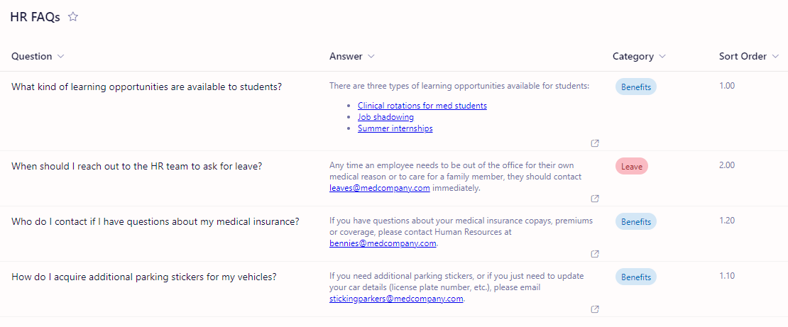

# faq-accordion

## Summary

- Extends the [FAQ Accordion webpart](https://github.com/pnp/sp-dev-fx-webparts/tree/main/samples/react-accordion-dynamic-section) by Valeras Narbutas, which extended [the orginal](https://github.com/pnp/sp-dev-fx-webparts/tree/main/samples/react-accordion-section) by Erik Benke and Mike Zimmerman. In addition to a category select, this version includes selecting a list on a specific site (defaults to current site), and selecting a column on which to sort displayed items.
- Adds a collapsible accordion widget ideal for displaying FAQs to a SharePoint page or Teams Tab.
- Allows display of rich text, including hyperlinks and images.
- This will generate an accordion with one section for each item in the list.
- Modifications to the source list are automatically reflected in the webpart.
- Category column allows multiple FAQ webparts to draw from and be managed by a single list.

## Usage

1. Create a SharePoint list with four columns:
    1. Title (required)
    2. Answer (required)
    3. Category (required)
    4. SortOrder (optional)
2. The default Title column that comes with a new SharePoint list can be renamed to "Question". After creating the other columns with the above names, you can rename them to whatever you want and the internal names (that the webpart uses for settings defaults) will remaine the same.
3. The **Answer** column should be of type **Multiple lines of text**. The Category column must be named **Category** and must be of type **Choice**. The **Sort Order** column is optional (items will be sorted by internal list ID by default), and can be of type **Single line of Text**, or **Number**. Leaving the second place of a decimal number with two places as 0 allows for future FAQ insertions without having to modify all items to maintain sort order.

4. Add the `faq-accordion.sppkg` to your SharePoint App Catalog and enable it on any sites you wish to add it to.
5. Edit a SharePoint page and select the new FAQ Accordion webpart.
6. Configure the webpart and publish the page

## Used SharePoint Framework Version

| :warning: Important          |
|:---------------------------|
| Every SPFx version is only compatible with specific version(s) of Node.js. In order to be able to build this sample, please ensure that the version of Node on your workstation matches one of the versions listed in this section. This sample will not work on a different version of Node.|
|Refer to <https://aka.ms/spfx-matrix> for more information on SPFx compatibility.   |

 

## Applies to

- [SharePoint Framework](https://aka.ms/spfx)
- [Microsoft 365 tenant](https://docs.microsoft.com/en-us/sharepoint/dev/spfx/set-up-your-developer-tenant)

## Version history

| Version | Date             | Comments        |
| ------- | ---------------- | --------------- |
| 1.0     | October 22, 2023 | Reused [Valeras Narbutas's](https://github.com/ValerasNarbutas) webpart|

## Minimal Path to Awesome

- Clone or download this repository
- Run in command line:
  - `npm install` to install the npm dependencies
  - `gulp serve` to display in Developer Workbench (recommend using your tenant workbench so you can test with real lists within your site)
- To package and deploy:
  - Use `gulp bundle --ship` & `gulp package-solution --ship`
  - Add the `.sppkg` to your SharePoint App Catalog

## Disclaimer

**THIS CODE IS PROVIDED _AS IS_ WITHOUT WARRANTY OF ANY KIND, EITHER EXPRESS OR IMPLIED, INCLUDING ANY IMPLIED WARRANTIES OF FITNESS FOR A PARTICULAR PURPOSE, MERCHANTABILITY, OR NON-INFRINGEMENT.**

---